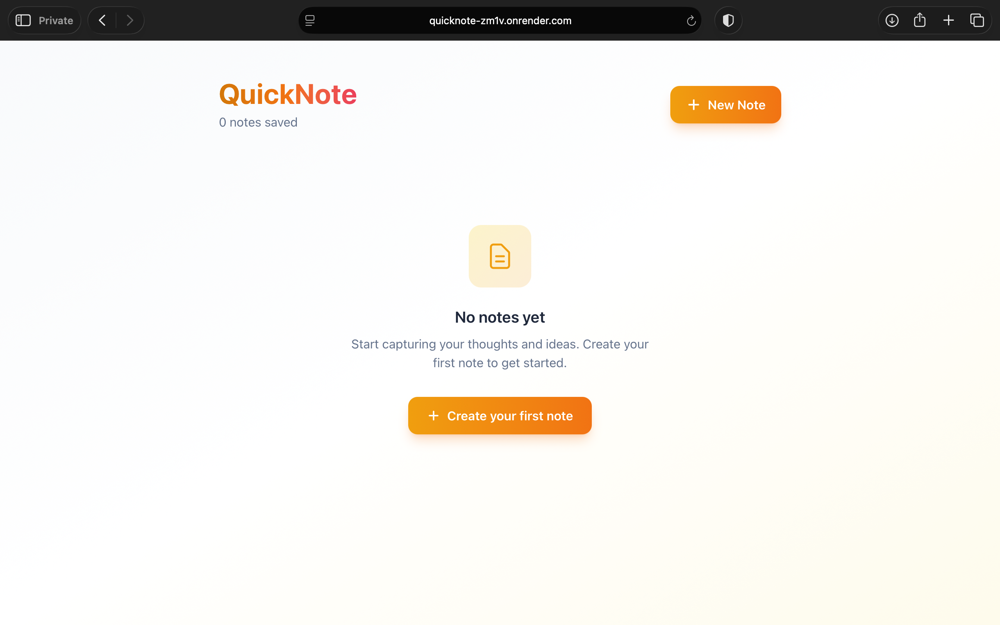

# QuickNote 📝

A simple note-taking app built with Ruby on Rails 8.



## ✨ Features

- **Create, Read, Update, Delete** - Full CRUD functionality for notes
- **Real-time Updates** - Notes appear/update instantly with Turbo Streams
- **Inline Editing** - Edit notes without leaving the page (Turbo Frames)
- **Responsive Design** - Works great on desktop and mobile
- **Modern UI** - Clean design with Tailwind CSS
- **Form Validation** - Title and body are required fields

## 🛠️ Tech Stack

- **Ruby** 3.2+
- **Rails** 8.1
- **Tailwind CSS** 4.0 - Styling
- **Hotwire** (Turbo + Stimulus) - Real-time interactivity

## 🚀 Getting Started

### Prerequisites

- Ruby 3.2 or higher
- Rails 8.1 or higher
- Node.js (for Tailwind CSS)

### Installation

1. **Clone the repository**

   ```bash
   git clone https://github.com/devashrisamani/rails-quicknote.git
   cd rails-quicknote
   ```

2. **Install dependencies**

   ```bash
   bundle install
   ```

3. **Setup the database**

   ```bash
   rails db:create
   rails db:migrate
   ```

4. **Start the development server**

   ```bash
   bin/dev
   ```

   This starts both the Rails server and Tailwind CSS watcher.

5. **Visit the app**
   Open [http://localhost:3000](http://localhost:3000) in your browser.

## 📁 Project Structure

```
app/
├── controllers/
│   └── notes_controller.rb    # Handles all note actions
├── models/
│   └── note.rb                # Note model with validations
├── views/
│   └── notes/
│       ├── index.html.erb     # List all notes
│       ├── show.html.erb      # View single note
│       ├── new.html.erb       # New note form
│       ├── edit.html.erb      # Edit note form
│       ├── _note.html.erb     # Note card partial
│       └── _form.html.erb     # Form partial
└── assets/
    └── tailwind/
        └── application.css    # Tailwind config
```

## 🔧 Key Files Explained

| File                                  | Purpose                                         |
| ------------------------------------- | ----------------------------------------------- |
| `config/routes.rb`                    | URL routing - maps URLs to controller actions   |
| `app/models/note.rb`                  | Note model - database interaction + validations |
| `app/controllers/notes_controller.rb` | Controller - handles HTTP requests              |
| `app/views/notes/`                    | Views - HTML templates                          |

## 🎨 Customization

### Change the Color Theme

The app uses an amber/orange color scheme. To change it, update these Tailwind classes in the view files:

- Primary colors: `amber-500`, `orange-500`
- Background: `slate-50`, `amber-50`
- Text: `slate-800`, `slate-600`

## 🚢 Deployment

### Deploy to Render

1. Create a new Web Service on [Render](https://render.com)
2. Connect your GitHub repository
3. Configure:
   - **Build Command**: `bundle install && rails db:migrate && rails assets:precompile`
   - **Start Command**: `bundle exec puma -C config/puma.rb`
4. Add environment variables:
   - `SECRET_KEY_BASE` - Generate with `rails secret`
   - `RAILS_ENV` = `production`

## 📝 API Endpoints

The app also supports JSON responses:

| Method | Endpoint          | Description       |
| ------ | ----------------- | ----------------- |
| GET    | `/notes.json`     | List all notes    |
| GET    | `/notes/:id.json` | Get a single note |
| POST   | `/notes.json`     | Create a note     |
| PATCH  | `/notes/:id.json` | Update a note     |
| DELETE | `/notes/:id.json` | Delete a note     |
